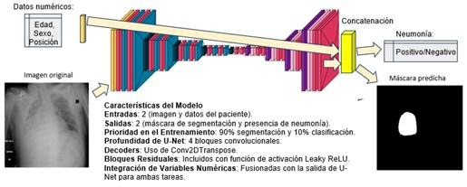

# Pneumonia-Detection-CNN
Repositorio del código para el TFM sobre la detección de neumonía en radiografías de tórax usando redes neuronales convolucionales (CNN). El proyecto incluye técnicas de clasificación de imágenes y segmentación para el diagnóstico automático de neumonía

## Resumen gráfico

## Estructura del repositorio:
#### 01_EDA.ipynb:
Exploratory Data Analysis (EDA) del dataset. Incluye un análisis descriptivo de las imágenes, distribución de las clases y variables numéricas como la edad, el sexo y la posición de las radiografías.

#### 02_Preprocessing.ipynb:
Proceso de preprocesamiento de los datos, que abarca la normalización de las imágenes, la gestión de valores atípicos y nulos, así como la transformación de las imágenes y las máscaras para su uso en los modelos de aprendizaje profundo.

#### 03_Classification_Models.ipynb:
Implementación de modelos de clasificación usando redes neuronales convolucionales para predecir la presencia de neumonía en las radiografías. Se incluyen las métricas utilizadas para evaluar los modelos, como accuracy, recall, y f1-score.

#### 04_Mixed_Models.ipynb:
Modelos mixtos que combinan segmentación y clasificación. Se incluye un enfoque donde se predice tanto la presencia de neumonía como la región afectada dentro del pulmón.

#### 05_Kermany_Testing.ipynb:
Pruebas realizadas con el dataset de Kermany para comparar los resultados de los modelos y validar su desempeño en un conjunto de datos diferente.

